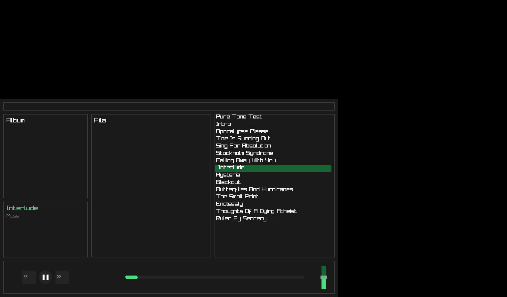

# MuPlayer

A music player built from scratch in C, using [Raylib](https://www.raylib.com/) for the graphical interface and audio streaming. The goal is to implement all low-level logic manually — from binary file parsing to the audio streaming pipeline — without relying on high-level media libraries.

> **⚠️ Atenção:** Atualmente, apenas arquivos **WAV** são suportados. FLAC e MP3 estão em desenvolvimento.

## Screenshots



## Features

- **Custom WAV binary parser** — reads RIFF/WAVE chunk structure directly, extracting `fmt` (sample rate, bit depth, channels), `LIST/INFO` metadata (title, artist) and the `data` chunk offset for streaming
- **Streaming playback** — audio is read from disk in 4096-frame blocks via `AudioStream`, avoiding loading the entire file into memory
- **Volume control** — sample-level float multiplication; slider in the control panel
- **Transport controls** — play/pause toggle, next/previous track, seek by clicking the progress bar
- **Auto-advance** — automatically plays the next track when the current one ends
- **Recursive directory traversal** — scans subdirectories using POSIX `dirent` to build the music library
- **Responsive UI** — layout adapts to window resizing; library list with scrollbar, queue panel *(UI placeholder, funcionalidade em breve)*, info panel and transport controls

## Architecture

```
src/
├── main.c             # Entry point — UI loop, input handling, layout (Raylib)
├── wavParser.c/h      # RIFF/WAVE binary parser
├── playback.c/h       # Audio streaming engine (play, pause, resume, stop, volume)
├── navfolder.c/h      # Recursive directory scanner (POSIX dirent)
├── circularBuffer.c/h # Ring buffer — reservado para pipeline de áudio futuro
├── flac.c/h           # FLAC structures and helpers (in progress)
└── structs.h          # Shared types (MusicMetadata, chunk, fmt_chunk)
```

## Building

**Requirements:** GCC, Make, Raylib (headers in `src/include`, lib in `src/lib`)

```bash
git clone https://github.com/GusthavoDarth/MuPlayer
cd MuPlayer
make
./MuPlayer        # Linux/macOS
MuPlayer.exe      # Windows (com MinGW)
```

Place `.wav` files in `Test_music_files/` (subfolders are scanned recursively).

## Controls

| Action | Input |
|--------|-------|
| Play / Pause | Click the circle button |
| Next track | Click `>>` |
| Previous track | Click `<<` |
| Seek | Click anywhere on the progress bar |
| Volume | Drag the slider in the control panel |
| Select track | Click any item in the library list |

## Status

| Format | Parsing | Playback |
|--------|---------|----------|
| WAV    | ✅ Complete | ✅ Functional |
| FLAC   | 🔄 In progress | ❌ Pending |
| MP3    | ❌ Pending | ❌ Pending |

## Roadmap

- [ ] FLAC decoder (frame parsing, prediction filters, Rice coding)
- [ ] MP3 parser (ID3 tags + frame decoding)
- [ ] Album art display
- [ ] Queue panel — drag-and-drop reorder
- [ ] **ESP32 port** — SD card via SPI, audio output via I2S (PCM5100A), ST7735 display

## Why this project

Building a media player without FFmpeg forces a direct understanding of how audio data is stored and streamed. Parsing RIFF chunks manually, calculating file offsets for streaming, and managing an audio buffer at the sample level are problems that map directly to embedded systems work — which is where this project is headed with the planned ESP32 port.
